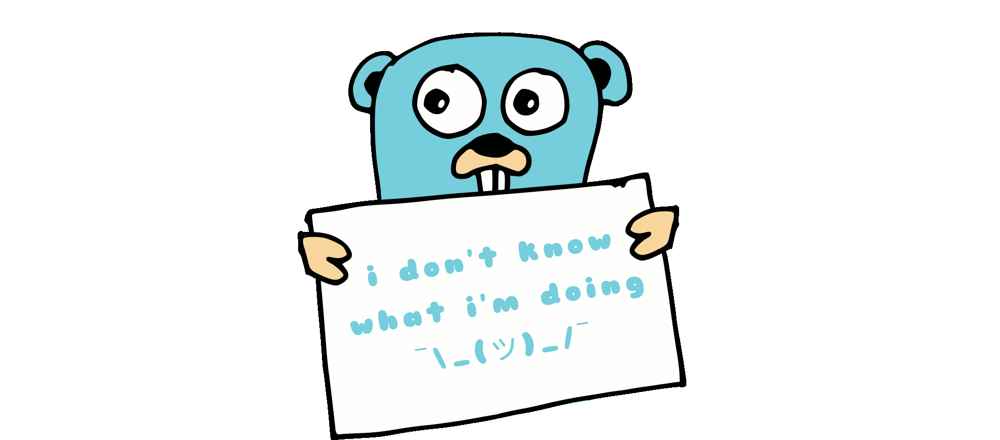

<h3 align="center">
  Welcome to Victoria Myts' profile!
  
</h3>

<code>🎓 Student: KPI / IM-12</code>
<code>⚪ Community: Metarhia</code>
<code>👷 Speciality: Software engineer / Fullstack eternal junior</code> 
<code>💡 [Skills](SKILLS.md)</code>
<code>🧻 [Projects](PROJECTS.md)</code>
<code>📢 [Public talks: 0](TALKS.md)</code>
<code>👀 [Open-source contribution](CONTRIBUTION.md)</code> 
<code>🧑‍💻 Languages: **JavaScript**, **Java**, **Python**, Dart, C, ~~PHP~~</code>
<code>📦 Tech stack: undefined</code>
<code>🪙 [Rates](RATES.md)</code> 
<code>💬 telegram: [@vimyts](https://telegram.me/vimyts) </code>
<code>📫 [mytsvictoria@gmail.com](mailto:mytsvictoria@gmail.com)</code>

